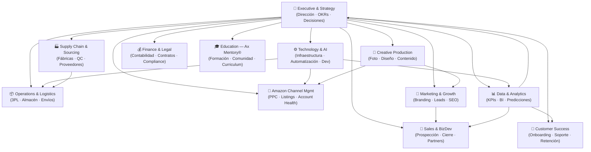

# AX Holding Group — Mapa de Departamentos 2026
### Estructura Organizacional AI-First para Servicios Amazon

> **Contexto:** AX Holding Group es una empresa española (Preixens, Lleida) especializada en servicios integrales para vendedores de Amazon: logística 3PL, gestión de cuentas Amazon, diseño creativo, sourcing con 400+ fábricas y formación a través de Ax Mentory®.
>
> Este documento es el punto de partida para reconstruir la empresa desde cero con una arquitectura AI-first donde el **85% de los procesos operativos están potenciados por inteligencia artificial**.

---

## Principios de Diseño Organizacional 2026

| Principio | Descripción |
|---|---|
| **AI-First** | Cada proceso tiene un agente o herramienta IA como primera capa de ejecución |
| **Async-First** | Comunicación y trabajo asíncrono como norma; reuniones solo para decisiones |
| **Data-Driven** | Ninguna decisión sin dato. KPIs en tiempo real para todos los departamentos |
| **SOP-Always** | Todo proceso documentado en SOP antes de delegar a humano o agente IA |
| **Lean Human Layer** | Los humanos supervisan, deciden y crean. La IA ejecuta, procesa y reporta |
| **Cross-functional** | Departamentos interdependientes con canales de datos claros entre ellos |

---

## Diagrama Organizacional

---

## Tabla Resumen de Departamentos

| # | Departamento | Función Principal | AI% | Archivo |
|---|---|---|---|---|
| 1 | Executive & Strategy | Dirección estratégica, OKRs, decisiones clave | 40% | [Ver →](./departments/01-executive-strategy.md) |
| 2 | Technology & AI | Infraestructura, automatización, pipelines de datos | 90% | [Ver →](./departments/02-technology-ai.md) |
| 3 | Operations & Logistics | 3PL, almacén, preparación de envíos, tracking | 85% | [Ver →](./departments/03-operations-logistics.md) |
| 4 | Amazon Channel Mgmt | PPC, listings, salud de cuenta, auditorías | 90% | [Ver →](./departments/04-amazon-channel.md) |
| 5 | Creative Production | Fotografía de producto, diseño, contenido visual | 70% | [Ver →](./departments/05-creative-production.md) |
| 6 | Supply Chain & Sourcing | Red de fábricas, control de calidad, sourcing | 80% | [Ver →](./departments/06-supply-chain-sourcing.md) |
| 7 | Sales & BizDev | Prospección, cierre de ventas, partnerships | 75% | [Ver →](./departments/07-sales-bizdev.md) |
| 8 | Customer Success | Onboarding, soporte, retención, reporting | 80% | [Ver →](./departments/08-customer-success.md) |
| 9 | Finance & Legal | Contabilidad, facturación, contratos, compliance | 85% | [Ver →](./departments/09-finance-legal.md) |
| 10 | Marketing & Growth | Branding, generación de leads, SEO, contenido | 80% | [Ver →](./departments/10-marketing-growth.md) |
| 11 | Education — Ax Mentory® | Formación de sellers, comunidad, curriculum | 75% | [Ver →](./departments/11-education-axmentory.md) |
| 12 | Data & Analytics | KPIs centralizados, BI, análisis predictivo | 95% | [Ver →](./departments/12-data-analytics.md) |

---

## Stack de Herramientas IA por Área (2026)

| Área | Herramientas Recomendadas |
|---|---|
| **Amazon Channel** | Helium 10 AI · Perpetua · Amazon Ads AI bidding · Claude API (copy) |
| **Operations / 3PL** | WMS con AI routing · n8n / Make (automatización) · Shipbob AI |
| **Creative** | Midjourney / Flux · Adobe Firefly · Runway (video) · Remove.bg |
| **Supply Chain** | Alibaba AI sourcing · Visión por computadora (QC) · Supplier AI scoring |
| **Sales** | Clay · Apollo AI · HubSpot AI CRM · Claude API (outreach personalizado) |
| **Customer Success** | Intercom AI · Notion AI (SOPs) · Dashboards automatizados (Make/n8n) |
| **Finance** | Holded / Xero AI · Agentes de facturación · Docusign AI |
| **Marketing** | Claude API (contenido) · Surfer SEO · Ahrefs AI · Canva AI |
| **Data & BI** | Metabase AI · dbt + BigQuery · Agentes Claude API · Looker Studio |
| **Education** | Circle (comunidad) · Loom AI · Notion AI · Claude API (curriculum) |

---

## Diagnóstico y Plan de Reconstrucción

Antes de implementar esta estructura, es esencial entender qué salió mal en los 2 años de MVP.

**→ Ver análisis completo:** [diagnosis.md](./diagnosis.md)

---

## Roadmap de Reconstrucción — Fases

### Fase 1 — Fundamentos (Semanas 1-4)
- [ ] Definir OKRs del año con roles claros entre los 2 cofundadores
- [ ] Implementar Data & Analytics (Departamento 12) — sin datos no hay nada
- [ ] Documentar los 3 procesos más críticos en SOPs
- [ ] Configurar CRM básico (HubSpot free) con pipeline de ventas

### Fase 2 — Automatización Core (Semanas 5-10)
- [ ] Automatizar Amazon Channel (PPC + listing monitoring)
- [ ] Conectar 3PL con WMS y alertas automáticas
- [ ] Implementar onboarding automatizado para nuevos clientes
- [ ] Activar pipeline de Marketing → Sales con IA

### Fase 3 — Escala (Semanas 11-20)
- [ ] Contratar/externalizar primera función operativa (Customer Success o Ops)
- [ ] Lanzar Ax Mentory® con curriculum AI-assisted
- [ ] Dashboard ejecutivo centralizado con todos los KPIs
- [ ] Sistema de Supply Chain con scoring de proveedores IA

---

*Última actualización: 2026-03-27 | Rama: `claude/company-departments-structure-z14ab`*
